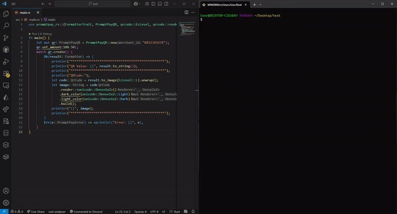

# PromptPay-RS

Welcome to `promptpay-rs`, a lightweight Rust library for generating PromptPay QR code compliant with EMVCo standards. This library is designed with modern Rust practices, providing a simple and efficient interface to create QR code for Thai payment systems, supporting phone numbers and Tax IDs.

## Features

- **EMVCo Compliance**: Generates PromptPay QR code payloads adhering to EMVCo Merchant Presented Mode standards.
- **Flexible Input**: Supports Thai phone numbers, Tax IDs, and E-Wallet IDs with proper formatting.
- **Uses `qrcode` = "0.14.1"**: Leverages the `qrcode` library to generate QR codes in various formats such as PNG, SVG, and more, with simplicity and flexibility.
- **Builder Pattern**: Intuitive API for constructing payloads with optional amount specification.

## Installation

Add `promptpay-rs` to your `Cargo.toml`:

```toml
[dependencies]
promptpay-rs = "0.4.0"
```

Then run:

```bash
cargo build
```

## Usage

Here is a quick example of how to use `promptpay-rs` to generate a PromptPay QR code payload:

```rust
use promptpay_rs::{
    FormatterTrait, PromptPayQR,
    qrcode::{EcLevel, render::unicode},
};

fn main() -> Result<(), Box<dyn std::error::Error>> {
    // Initialize a new PromptPay QR object with a phone number
    // This will be the recipient of the payment.
    let mut qr = PromptPayQR::new("081-234-5678");

    // Set the payment amount for the QR code
    // The amount is in THB (Thai Baht)
    qr.set_amount(250.75);

    // Create the QR payload using the formatter
    // This payload is a string representation following PromptPay's standard
    let formatter = qr.create()?;

    // Convert the formatter payload into a string
    let payload = formatter.to_string();
    println!("Payload: {}", payload);

    // Generate the QR code image from the payload
    let qr_code = formatter.to_image(EcLevel::M)?;

    // Render the QR code in Unicode format for terminal display
    let image = qr_code
        .render::<unicode::Dense1x2>()
        .dark_color(unicode::Dense1x2::Light)
        .light_color(unicode::Dense1x2::Dark)
        .build();

    // Print the QR code in the terminal
    println!("{}", image);

    Ok(())
}

```

This will generate a value like:

```
00020101021229370016A000000677010111011300668123456785802TH53037645406100.506304XXXX
```

You can use this value with a QR code generation library (e.g., `qrcode`) or default function `to_image` to create a scannable QR code for Thai banking apps.



## Documentation

Comprehensive documentation is available at [docs.rs/promptpay-rs](https://docs.rs/promptpay-rs).

## Contributing

Contributions are welcome! Please submit a pull request to branch `develop` or open an issue on the [GitHub repository](https://github.com/mantvmass/promptpay-rs) for bug reports, feature requests, or suggestions.

## Disclaimer

This library is unofficial and is not affiliated with or endorsed by PromptPay or the Bank of Thailand. Use it at your own risk.

## License

This project is licensed under the MIT License. See the [LICENSE](LICENSE) file for details.